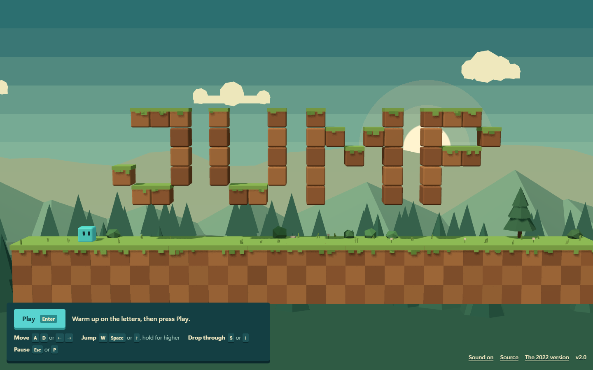

# Jump

A small 2.5D platformer about a cyan cube crossing a sunset valley. Built with Three.js,
TypeScript and Vite.



Play it at <https://mihir9702.github.io/jump/>. The 2022 original's code is kept in
`legacy/` for reference but is not deployed.

## Controls

| Action                      | Keyboard              | Gamepad              | Touch          |
| --------------------------- | --------------------- | -------------------- | -------------- |
| Move                        | A D or ← →            | Left stick or d-pad  | ◀ ▶ buttons    |
| Jump (hold to jump higher)  | W, Space or ↑         | A                    | ▲ button       |
| Drop through thin platforms | S or ↓                | Down                 | ▼ button       |
| Pause and resume            | Esc or P              | Start (B resumes)    | Pause button   |
| Restart the level           | R                     | Pause menu           | Pause menu     |
| Sound on or off             | M                     | Pause menu           | Title or pause |
| Start from the title        | Enter                 | Start                | Play button    |

The title screen is a playground: the letters are jump-through platforms, so you can try
the controls before starting. Touch buttons appear on touch screens, and on-screen hints
follow whichever input you used last.

## How it plays

Three short levels, played in order: Meadow, Ridge and Sunset Peak. Collect coins, avoid
spikes and reach the flag. Falling off restarts you at once, at the last checkpoint you
touched. Coins picked up since that checkpoint go back. The clock keeps running through
falls and stops while paused. The results screen shows your time, coins and falls for
each level, and the browser remembers your fastest full run.

The movement is the feel from the playable hero on the portfolio site: acceleration and
friction, variable jump height (let go early for a short hop), coyote time (a moment to
jump after running off a ledge), jump buffering (press jump just before landing),
one-way platforms you can jump up through and drop down from, and squash and stretch.

## Run it

You need Node.js 22.18 or newer (24 recommended).

```sh
npm install
npm run dev        # http://localhost:5173/jump/
npm test           # physics tests, and a solver that proves every level can be finished
npm run build      # type-checks, then builds the static site into dist/
npm run preview    # serves dist/ at http://localhost:4173/jump/
```

`npm run playtest` plays the built game in headless Chrome (run `npm run build` first). It
drives the real game with key presses, touch and a stand-in gamepad, finishes every level,
checks resizing, high-DPI screens, reduced motion and the console, and saves screenshots to
`.playtest/`. Use `npm run playtest -- --out docs/screenshots` to refresh the images in this
README. Set `CHROME_PATH` if Chrome is not installed in the default Windows location.

Adding `?debug` to the address exposes `window.__jump` for tests: the current state, a
teleport, and a way to start a level or replay a recorded route.

## Deploy

`npm run build` produces a static site in `dist/` for GitHub Pages under `/jump/` (set by
`base` in `vite.config.ts`). `legacy/` is not part of the build.

`npm run deploy` runs the tests, builds, and force-pushes `dist/` to the `gh-pages` branch.
GitHub Pages serves that branch (Settings > Pages > Build and deployment > Source: **Deploy
from a branch**, `gh-pages`, `/ (root)`). It only needs ordinary push access to this
repository, with no GitHub Actions workflow. It refuses to run with uncommitted changes, so
the live site always matches a commit.

## What's new in v2

- Rebuilt in Three.js, TypeScript and Vite. The world is now 2.5D: voxel blocks with real
  depth, a low-angle camera, soft sunlight with shadows, light fog, and four parallax
  layers of mountains, forest and hills behind the level. The cube is still cyan, now with
  eyes that look where it is going.
- A new movement feel with acceleration, variable jump height, coyote time, jump buffering
  and one-way platforms. The simulation runs at a fixed 120 steps a second with smooth,
  interpolated rendering.
- Three hand-made levels instead of one, with coins, spikes, checkpoints and a goal flag.
- Title, pause, level complete and results screens, with time and coins for every level.
- Gamepad and touch controls alongside the keyboard.
- Instant restarts when you fall, instead of pressing R on a game over screen.
- Pauses when you switch tabs, respects reduced-motion settings (steadier camera, fewer
  particles), and adapts to window size and screen density.
- Sound effects generated in the browser. There are no audio files, and nothing plays until
  you press a key or tap.
- The 2022 version is kept in `legacy/`, unchanged.

## How it is built

```
src/
  sim/        Game rules with no rendering: level parsing, player physics, world
  levels/     The levels as JSON maps, and the order they are played in
  render/     Three.js: stage (camera, light, fog), backdrop, level blocks, player, particles
  input/      Keyboard, gamepad and touch, merged into one set of buttons
  ui/         Screens, HUD and hints, and the block lettering used for headings
  audio/      Synthesized sound effects
  game/       The loop, the screens flow and level progression
test/         Physics and level tests (node --test)
tools/        solver.ts finds routes through levels; playtest.mjs drives headless Chrome
legacy/       The 2022 version
```

The simulation in `src/sim` has no Three.js or browser dependencies, which is why the tests
and the level solver can run it directly on Node.

### Making levels

Levels are ASCII maps in `src/levels/*.json`. Rows run top to bottom, and each character is
one tile:

| Symbol    | Meaning                                                   |
| --------- | --------------------------------------------------------- |
| space `.` | Empty                                                     |
| `#`       | Solid ground                                              |
| `=`       | One-way platform: jump up through it, press down to drop  |
| `o`       | Coin                                                      |
| `P`       | Player start                                              |
| `F`       | Goal flag                                                 |
| `C`       | Checkpoint                                                |
| `^` `v`   | Spikes on a floor, or hanging from a ceiling              |
| `L`       | Letter block (title screen only)                          |

A level can also list `hints`: a column and one of `through`, `hold` or `drop`, which shows
a short tip while the player is nearby. Run `npm test` after editing a map. It fails if a
level cannot be finished, or a coin cannot be reached, with the real physics.

## Credits

Everything in v2 is original to this project. The blocks, scenery and effects are built
from geometry in code, the sounds are synthesized, and the block lettering is drawn in
code. There are no font files: the interface uses your system font. The 2022 version in
`legacy/` keeps its own assets and is not part of the v2 game.
